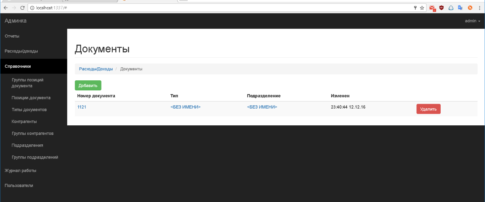
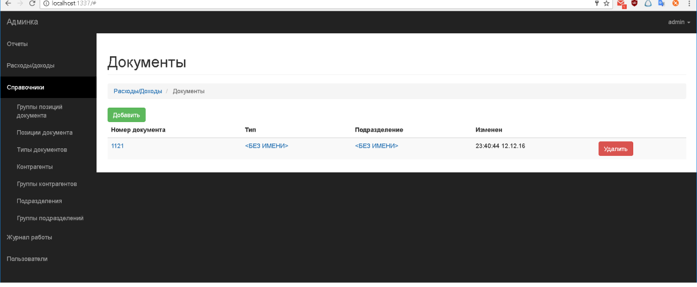

# afinance2
Small CRM system for one customer.

Trying sailsjs and angular 1 frameworks here.

Supports two roles - operator and admin.

Sorry, interface only in Russian.

## screenshots 



## Installation && run
1. thanks to sails, we can choose a desired db to use from a list of [supported db](http://sailsjs.com/documentation/concepts/extending-sails/adapters/available-adapters). 
2. put db connection info in the config/connectons.js
3. install npm packages and run sails
```
$>npm install
$>sails lift
```